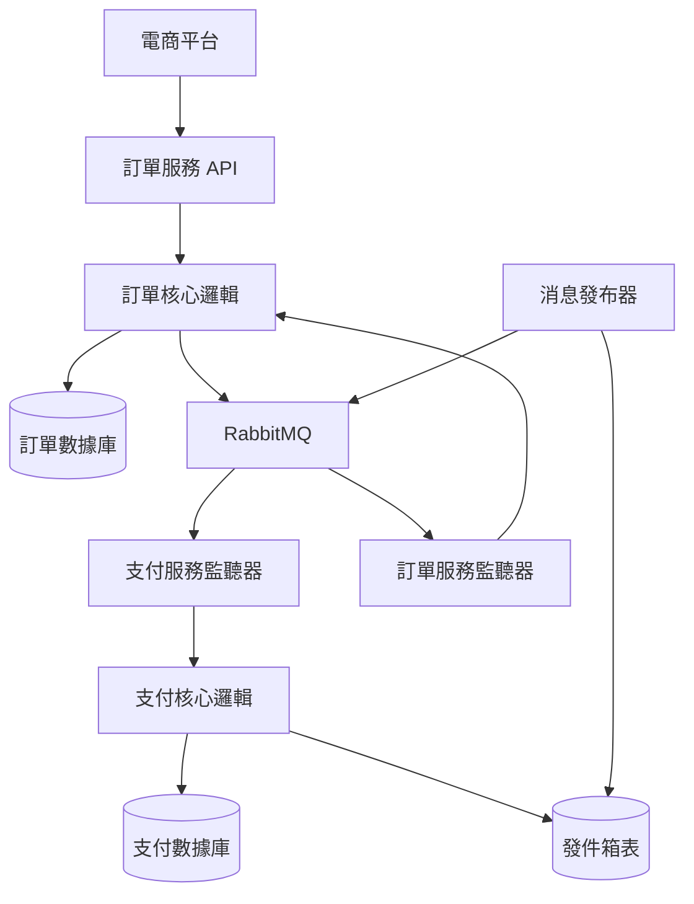

# 設計文檔

## 概述

本設計文檔描述了訂單處理和信用卡支付系統的實現方案。該系統採用六角形架構，使用 RabbitMQ 進行服務間通信，並實現 Outbox Pattern 來確保數據一致性。系統包含訂單服務和支付服務兩個微服務，使用 Spring Boot、JDK 17 和 Gradle 構建。

## 架構

### 整體架構圖



### 核心架構原則

1. **六角形架構**: 業務邏輯與外部依賴完全隔離
2. **DDD 領域驅動設計**: 使用聚合、實體、值對象和領域服務進行建模
3. **SOLID 原則**: 遵循所有五個 SOLID 設計原則
4. **強一致性**: 通過 Outbox Pattern 確保數據庫與消息的一致性
5. **服務自治**: 每個微服務擁有自己的數據庫和業務邏輯
6. **可靠消息傳遞**: 實現重試機制和確認機制
7. **統一日誌記錄**: 使用 Spring AOP 實現橫切關注點的日誌記錄

## DDD 領域建模

### 訂單領域 (Order Domain)

#### 訂單聚合 (Order Aggregate)
```java
@Entity
@Table(name = "orders")
public class Order extends AggregateRoot {
    @Id
    private OrderId orderId;
    private CustomerId customerId;
    private Money amount;
    private OrderStatus status;
    private LocalDateTime createdAt;
    private LocalDateTime updatedAt;
    
    public void requestPayment(PaymentRequest paymentRequest) {
        // 業務邏輯驗證
        validatePaymentRequest(paymentRequest);
        
        // 狀態變更
        this.status = OrderStatus.PAYMENT_PENDING;
        
        // 發布領域事件
        addDomainEvent(new PaymentRequestedEvent(this.orderId, paymentRequest));
    }
    
    public void confirmPayment(PaymentConfirmation confirmation) {
        if (this.status != OrderStatus.PAYMENT_PENDING) {
            throw new InvalidOrderStateException("Order is not in payment pending state");
        }
        
        this.status = OrderStatus.PAYMENT_CONFIRMED;
        addDomainEvent(new PaymentConfirmedEvent(this.orderId, confirmation));
    }
}
```

#### 值對象 (Value Objects)
```java
@Embeddable
public class OrderId {
    private String value;
    
    public OrderId(String value) {
        if (value == null || value.trim().isEmpty()) {
            throw new IllegalArgumentException("Order ID cannot be null or empty");
        }
        this.value = value;
    }
}

@Embeddable
public class Money {
    private BigDecimal amount;
    private Currency currency;
    
    public Money(BigDecimal amount, Currency currency) {
        if (amount.compareTo(BigDecimal.ZERO) <= 0) {
            throw new IllegalArgumentException("Amount must be positive");
        }
        this.amount = amount;
        this.currency = currency;
    }
}

@Embeddable
public class CustomerId {
    private String value;
    
    public CustomerId(String value) {
        if (value == null || value.trim().isEmpty()) {
            throw new IllegalArgumentException("Customer ID cannot be null or empty");
        }
        this.value = value;
    }
}
```

### 支付領域 (Payment Domain)

#### 支付聚合 (Payment Aggregate)
```java
@Entity
@Table(name = "payment_records")
public class Payment extends AggregateRoot {
    @Id
    private PaymentId paymentId;
    private TransactionId transactionId;
    private OrderId orderId;
    private Money amount;
    private CreditCard creditCard;
    private PaymentStatus status;
    private LocalDateTime processedAt;
    
    public PaymentResult process(CreditCardValidator validator) {
        // 領域邏輯：驗證信用卡
        ValidationResult validationResult = validator.validate(this.creditCard);
        
        if (!validationResult.isValid()) {
            this.status = PaymentStatus.FAILED;
            addDomainEvent(new PaymentFailedEvent(this.paymentId, validationResult.getErrorMessage()));
            return PaymentResult.failed(validationResult.getErrorMessage());
        }
        
        // 模擬支付處理
        this.status = PaymentStatus.SUCCESS;
        this.processedAt = LocalDateTime.now();
        
        addDomainEvent(new PaymentProcessedEvent(this.paymentId, this.orderId, this.amount));
        return PaymentResult.success(this.paymentId);
    }
}
```

#### 支付值對象
```java
@Embeddable
public class CreditCard {
    private String cardNumber;
    private String expiryDate;
    private String cvv;
    private String cardHolderName;
    
    public CreditCard(String cardNumber, String expiryDate, String cvv, String cardHolderName) {
        validateCardNumber(cardNumber);
        validateExpiryDate(expiryDate);
        validateCvv(cvv);
        validateCardHolderName(cardHolderName);
        
        this.cardNumber = maskCardNumber(cardNumber);
        this.expiryDate = expiryDate;
        this.cvv = cvv;
        this.cardHolderName = cardHolderName;
    }
    
    private void validateCardNumber(String cardNumber) {
        // Luhn 算法驗證
        if (!isValidCardNumber(cardNumber)) {
            throw new InvalidCreditCardException("Invalid card number");
        }
    }
}
```

### 領域服務 (Domain Services)
```java
@Service
public class PaymentDomainService {
    
    public PaymentResult processPayment(Payment payment, CreditCardValidator validator) {
        return payment.process(validator);
    }
    
    public boolean canRetryPayment(Payment payment) {
        return payment.getStatus() == PaymentStatus.FAILED 
            && payment.getRetryCount() < MAX_RETRY_ATTEMPTS;
    }
}
```

### 聚合根基類
```java
public abstract class AggregateRoot {
    private List<DomainEvent> domainEvents = new ArrayList<>();
    
    protected void addDomainEvent(DomainEvent event) {
        this.domainEvents.add(event);
    }
    
    public List<DomainEvent> getDomainEvents() {
        return Collections.unmodifiableList(domainEvents);
    }
    
    public void clearDomainEvents() {
        this.domainEvents.clear();
    }
}
```

## Spring AOP 日誌記錄系統

### 日誌記錄 Starter 設計

#### 日誌記錄註解
```java
@Target({ElementType.METHOD, ElementType.TYPE})
@Retention(RetentionPolicy.RUNTIME)
@Documented
public @interface LogApiRequest {
    String operation() default "";
    boolean logRequest() default true;
    boolean logResponse() default true;
    boolean logExecutionTime() default true;
}

@Target({ElementType.METHOD, ElementType.TYPE})
@Retention(RetentionPolicy.RUNTIME)
@Documented
public @interface LogMessageEvent {
    String eventType() default "";
    boolean logPayload() default true;
    boolean logHeaders() default false;
}
```

#### AOP 切面實現
```java
@Aspect
@Component
@Slf4j
public class ApiRequestLoggingAspect {
    
    private final RequestLogService requestLogService;
    
    @Around("@annotation(logApiRequest)")
    public Object logApiRequest(ProceedingJoinPoint joinPoint, LogApiRequest logApiRequest) throws Throwable {
        String requestId = UUID.randomUUID().toString();
        String operation = logApiRequest.operation().isEmpty() 
            ? joinPoint.getSignature().getName() 
            : logApiRequest.operation();
        
        ApiRequestLog requestLog = ApiRequestLog.builder()
            .requestId(requestId)
            .operation(operation)
            .className(joinPoint.getTarget().getClass().getSimpleName())
            .methodName(joinPoint.getSignature().getName())
            .timestamp(LocalDateTime.now())
            .build();
        
        if (logApiRequest.logRequest()) {
            requestLog.setRequestPayload(serializeArgs(joinPoint.getArgs()));
        }
        
        long startTime = System.currentTimeMillis();
        
        try {
            Object result = joinPoint.proceed();
            
            long executionTime = System.currentTimeMillis() - startTime;
            requestLog.setExecutionTimeMs(executionTime);
            requestLog.setStatus("SUCCESS");
            
            if (logApiRequest.logResponse()) {
                requestLog.setResponsePayload(serialize(result));
            }
            
            requestLogService.saveRequestLog(requestLog);
            
            log.info("API Request completed - RequestId: {}, Operation: {}, ExecutionTime: {}ms", 
                requestId, operation, executionTime);
            
            return result;
            
        } catch (Exception e) {
            long executionTime = System.currentTimeMillis() - startTime;
            requestLog.setExecutionTimeMs(executionTime);
            requestLog.setStatus("ERROR");
            requestLog.setErrorMessage(e.getMessage());
            
            requestLogService.saveRequestLog(requestLog);
            
            log.error("API Request failed - RequestId: {}, Operation: {}, Error: {}", 
                requestId, operation, e.getMessage(), e);
            
            throw e;
        }
    }
}

@Aspect
@Component
@Slf4j
public class MessageEventLoggingAspect {
    
    private final MessageLogService messageLogService;
    
    @Around("@annotation(logMessageEvent)")
    public Object logMessageEvent(ProceedingJoinPoint joinPoint, LogMessageEvent logMessageEvent) throws Throwable {
        String messageId = UUID.randomUUID().toString();
        String eventType = logMessageEvent.eventType().isEmpty() 
            ? joinPoint.getSignature().getName() 
            : logMessageEvent.eventType();
        
        MessageEventLog eventLog = MessageEventLog.builder()
            .messageId(messageId)
            .eventType(eventType)
            .className(joinPoint.getTarget().getClass().getSimpleName())
            .methodName(joinPoint.getSignature().getName())
            .timestamp(LocalDateTime.now())
            .build();
        
        if (logMessageEvent.logPayload()) {
            eventLog.setPayload(serializeArgs(joinPoint.getArgs()));
        }
        
        try {
            Object result = joinPoint.proceed();
            
            eventLog.setStatus("SUCCESS");
            messageLogService.saveMessageLog(eventLog);
            
            log.info("Message Event processed - MessageId: {}, EventType: {}", messageId, eventType);
            
            return result;
            
        } catch (Exception e) {
            eventLog.setStatus("ERROR");
            eventLog.setErrorMessage(e.getMessage());
            
            messageLogService.saveMessageLog(eventLog);
            
            log.error("Message Event failed - MessageId: {}, EventType: {}, Error: {}", 
                messageId, eventType, e.getMessage(), e);
            
            throw e;
        }
    }
}
```

#### 日誌數據模型
```java
@Entity
@Table(name = "api_request_logs")
@Data
@Builder
@NoArgsConstructor
@AllArgsConstructor
public class ApiRequestLog {
    @Id
    private String requestId;
    private String operation;
    private String className;
    private String methodName;
    private String requestPayload;
    private String responsePayload;
    private String status;
    private String errorMessage;
    private Long executionTimeMs;
    private LocalDateTime timestamp;
}

@Entity
@Table(name = "message_event_logs")
@Data
@Builder
@NoArgsConstructor
@AllArgsConstructor
public class MessageEventLog {
    @Id
    private String messageId;
    private String eventType;
    private String className;
    private String methodName;
    private String payload;
    private String headers;
    private String status;
    private String errorMessage;
    private LocalDateTime timestamp;
}
```

#### 日誌服務接口
```java
public interface RequestLogService {
    void saveRequestLog(ApiRequestLog requestLog);
    List<ApiRequestLog> findByOperation(String operation);
    List<ApiRequestLog> findByTimeRange(LocalDateTime start, LocalDateTime end);
}

public interface MessageLogService {
    void saveMessageLog(MessageEventLog messageLog);
    List<MessageEventLog> findByEventType(String eventType);
    List<MessageEventLog> findByTimeRange(LocalDateTime start, LocalDateTime end);
}
```

#### 自動配置類
```java
@Configuration
@EnableAspectJAutoProxy
@ConditionalOnProperty(name = "microservice.logging.enabled", havingValue = "true", matchIfMissing = true)
public class MicroserviceLoggingAutoConfiguration {
    
    @Bean
    @ConditionalOnMissingBean
    public ApiRequestLoggingAspect apiRequestLoggingAspect(RequestLogService requestLogService) {
        return new ApiRequestLoggingAspect(requestLogService);
    }
    
    @Bean
    @ConditionalOnMissingBean
    public MessageEventLoggingAspect messageEventLoggingAspect(MessageLogService messageLogService) {
        return new MessageEventLoggingAspect(messageLogService);
    }
    
    @Bean
    @ConditionalOnMissingBean
    public RequestLogService requestLogService(RequestLogRepository repository) {
        return new RequestLogServiceImpl(repository);
    }
    
    @Bean
    @ConditionalOnMissingBean
    public MessageLogService messageLogService(MessageLogRepository repository) {
        return new MessageLogServiceImpl(repository);
    }
}
```

#### Starter 配置屬性
```java
@ConfigurationProperties(prefix = "microservice.logging")
@Data
public class MicroserviceLoggingProperties {
    private boolean enabled = true;
    private boolean logRequestPayload = true;
    private boolean logResponsePayload = true;
    private boolean logMessagePayload = true;
    private boolean logMessageHeaders = false;
    private int maxPayloadLength = 10000;
    private List<String> excludePatterns = new ArrayList<>();
}
```

## 組件和接口

### 訂單服務組件

#### 訂單控制器 (Order Controller)
**職責**: 處理 HTTP 請求並協調業務邏輯

**核心接口**:
```java
@RestController
@RequestMapping("/api/orders")
@LogApiRequest
public class OrderController {
    
    @PostMapping
    @LogApiRequest(operation = "CREATE_ORDER", logRequest = true, logResponse = true)
    public ResponseEntity<OrderResponse> createOrder(@RequestBody CreateOrderRequest request);
    
    @GetMapping("/{orderId}")
    @LogApiRequest(operation = "GET_ORDER", logRequest = true, logResponse = true)
    public ResponseEntity<OrderResponse> getOrder(@PathVariable String orderId);
}
```

#### 訂單服務 (Order Service)
**職責**: 核心業務邏輯處理

**核心接口**:
```java
public interface OrderService {
    OrderResult createOrder(CreateOrderCommand command);
    Order getOrder(String orderId);
    void handlePaymentConfirmation(PaymentConfirmation confirmation);
}
```

#### 訂單倉儲 (Order Repository)
**職責**: 數據持久化抽象

**核心接口**:
```java
public interface OrderRepository {
    void save(Order order);
    Optional<Order> findById(String orderId);
    void savePaymentRequest(PaymentRequestRecord record);
    void saveRetryAttempt(RetryAttemptRecord record);
}
```

#### 消息發送器 (Message Publisher)
**職責**: 發送消息到 RabbitMQ

**核心接口**:
```java
public interface MessagePublisher {
    @LogMessageEvent(eventType = "PAYMENT_REQUEST_SENT", logPayload = true)
    void publishPaymentRequest(PaymentRequest request);
    
    @LogMessageEvent(eventType = "RETRY_SCHEDULED", logPayload = true)
    void scheduleRetry(String orderId, int attemptNumber);
}
```

### 支付服務組件

#### 支付監聽器 (Payment Listener)
**職責**: 監聽 RabbitMQ 消息

**核心接口**:
```java
@Component
public class PaymentListener {
    
    @RabbitListener(queues = "payment.request.queue")
    @LogMessageEvent(eventType = "PAYMENT_REQUEST_RECEIVED", logPayload = true)
    public void handlePaymentRequest(PaymentRequest request);
}
```

#### 支付服務 (Payment Service)
**職責**: 支付業務邏輯處理

**核心接口**:
```java
public interface PaymentService {
    PaymentResult processPayment(PaymentRequest request);
    void validateCreditCard(CreditCardInfo cardInfo);
}
```

#### 支付倉儲 (Payment Repository)
**職責**: 支付數據持久化

**核心接口**:
```java
public interface PaymentRepository {
    void savePaymentRecord(PaymentRecord record);
    void saveToOutbox(OutboxEvent event);
    List<OutboxEvent> findUnprocessedEvents();
    void markEventAsProcessed(String eventId);
}
```

#### 發件箱發布器 (Outbox Publisher)
**職責**: 處理 Outbox Pattern 消息發送

**核心接口**:
```java
@Component
public class OutboxPublisher {
    
    @Scheduled(fixedDelay = 5000)
    public void publishPendingEvents();
    
    private void publishEvent(OutboxEvent event);
}
```

## 數據模型

### 訂單相關模型

#### 訂單實體 (Order Entity)
```java
@Entity
@Table(name = "orders")
public class Order {
    @Id
    private String orderId;
    private String customerId;
    private BigDecimal amount;
    private String currency;
    private OrderStatus status;
    private LocalDateTime createdAt;
    private LocalDateTime updatedAt;
}

public enum OrderStatus {
    CREATED, PAYMENT_PENDING, PAYMENT_CONFIRMED, PAYMENT_FAILED, CANCELLED
}
```

#### 支付請求記錄 (Payment Request Record)
```java
@Entity
@Table(name = "payment_requests")
public class PaymentRequestRecord {
    @Id
    private String requestId;
    private String orderId;
    private String transactionId;
    private RequestStatus status;
    private LocalDateTime sentAt;
    private LocalDateTime confirmedAt;
    private int retryCount;
}
```

### 支付相關模型

#### 支付請求 (Payment Request)
```java
public class PaymentRequest {
    private String transactionId;
    private String orderId;
    private String customerId;
    private BigDecimal amount;
    private String currency;
    private CreditCardInfo creditCard;
    private BillingAddress billingAddress;
    private String merchantId;
    private String description;
    private LocalDateTime timestamp;
}
```

#### 信用卡信息 (Credit Card Info)
```java
public class CreditCardInfo {
    private String cardNumber;
    private String expiryDate;
    private String cvv;
    private String cardHolderName;
}
```

#### 帳單地址 (Billing Address)
```java
public class BillingAddress {
    private String street;
    private String city;
    private String postalCode;
    private String country;
}
```

#### 支付記錄 (Payment Record)
```java
@Entity
@Table(name = "payment_records")
public class PaymentRecord {
    @Id
    private String paymentId;
    private String transactionId;
    private String orderId;
    private BigDecimal amount;
    private String currency;
    private PaymentStatus status;
    private String gatewayResponse;
    private LocalDateTime processedAt;
}
```

#### 發件箱事件 (Outbox Event)
```java
@Entity
@Table(name = "outbox_events")
public class OutboxEvent {
    @Id
    private String eventId;
    private String eventType;
    private String aggregateId;
    private String payload;
    private LocalDateTime createdAt;
    private LocalDateTime processedAt;
    private boolean processed;
}
```

## 錯誤處理

### 重試機制

#### 訂單服務重試策略
```java
@Component
public class PaymentRetryService {
    
    private static final int MAX_RETRY_ATTEMPTS = 5;
    private static final long BASE_DELAY_MS = 1000;
    
    @Scheduled(fixedDelay = 30000)
    public void processRetries() {
        List<PaymentRequestRecord> pendingRequests = orderRepository.findPendingRequests();
        
        for (PaymentRequestRecord request : pendingRequests) {
            if (shouldRetry(request)) {
                retryPaymentRequest(request);
            }
        }
    }
    
    private boolean shouldRetry(PaymentRequestRecord request) {
        return request.getRetryCount() < MAX_RETRY_ATTEMPTS 
            && isRetryTimeReached(request);
    }
    
    private long calculateDelay(int attemptNumber) {
        return BASE_DELAY_MS * (long) Math.pow(2, attemptNumber);
    }
}
```

### 異常處理

#### 全局異常處理器
```java
@ControllerAdvice
public class GlobalExceptionHandler {
    
    @ExceptionHandler(OrderNotFoundException.class)
    public ResponseEntity<ErrorResponse> handleOrderNotFound(OrderNotFoundException ex) {
        return ResponseEntity.notFound().build();
    }
    
    @ExceptionHandler(PaymentProcessingException.class)
    public ResponseEntity<ErrorResponse> handlePaymentError(PaymentProcessingException ex) {
        return ResponseEntity.status(HttpStatus.PAYMENT_REQUIRED)
            .body(new ErrorResponse(ex.getMessage()));
    }
}
```

### 消息處理錯誤

#### 死信隊列配置
```java
@Configuration
public class RabbitMQConfig {
    
    @Bean
    public Queue paymentRequestQueue() {
        return QueueBuilder.durable("payment.request.queue")
            .withArgument("x-dead-letter-exchange", "payment.dlx")
            .withArgument("x-dead-letter-routing-key", "payment.failed")
            .build();
    }
    
    @Bean
    public Queue deadLetterQueue() {
        return QueueBuilder.durable("payment.failed.queue").build();
    }
}

## 測試策略

### BDD 測試驅動開發

**測試金字塔結構**:
1. **Cucumber BDD 測試** - 業務場景驗證（端到端）
2. **集成測試** - 組件間交互測試  
3. **單元測試** - 業務邏輯測試

#### Cucumber 框架配置
```gradle
dependencies {
    testImplementation 'io.cucumber:cucumber-java:7.14.0'
    testImplementation 'io.cucumber:cucumber-spring:7.14.0'
    testImplementation 'io.cucumber:cucumber-junit-platform-engine:7.14.0'
}
```

#### BDD 測試配置
```java
@CucumberTest
@SpringBootTest(webEnvironment = SpringBootTest.WebEnvironment.RANDOM_PORT)
@Testcontainers
public class CucumberIntegrationTest {
    
    @Container
    static RabbitMQContainer rabbitMQ = new RabbitMQContainer("rabbitmq:3-management");
    
    @Container
    static PostgreSQLContainer<?> postgres = new PostgreSQLContainer<>("postgres:15")
            .withDatabaseName("testdb")
            .withUsername("test")
            .withPassword("test");
}
```

### 單元測試

#### 訂單服務測試
```java
@ExtendWith(MockitoExtension.class)
class OrderServiceTest {
    
    @Mock
    private OrderRepository orderRepository;
    
    @Mock
    private MessagePublisher messagePublisher;
    
    @InjectMocks
    private OrderServiceImpl orderService;
    
    @Test
    void shouldCreateOrderAndSendPaymentRequest() {
        // Given
        CreateOrderCommand command = new CreateOrderCommand(/*...*/);
        
        // When
        OrderResult result = orderService.createOrder(command);
        
        // Then
        verify(orderRepository).save(any(Order.class));
        verify(messagePublisher).publishPaymentRequest(any(PaymentRequest.class));
        assertThat(result.getOrderId()).isNotNull();
    }
}
```

#### 支付服務測試
```java
@ExtendWith(MockitoExtension.class)
class PaymentServiceTest {
    
    @Mock
    private PaymentRepository paymentRepository;
    
    @Mock
    private CreditCardValidator creditCardValidator;
    
    @InjectMocks
    private PaymentServiceImpl paymentService;
    
    @Test
    void shouldProcessPaymentSuccessfully() {
        // Given
        PaymentRequest request = createValidPaymentRequest();
        when(creditCardValidator.validate(any())).thenReturn(true);
        
        // When
        PaymentResult result = paymentService.processPayment(request);
        
        // Then
        verify(paymentRepository).savePaymentRecord(any(PaymentRecord.class));
        verify(paymentRepository).saveToOutbox(any(OutboxEvent.class));
        assertThat(result.getStatus()).isEqualTo(PaymentStatus.SUCCESS);
    }
}
```

### 集成測試

#### RabbitMQ 集成測試
```java
@SpringBootTest
@Testcontainers
class MessageIntegrationTest {
    
    @Container
    static RabbitMQContainer rabbitMQ = new RabbitMQContainer("rabbitmq:3-management");
    
    @Autowired
    private MessagePublisher messagePublisher;
    
    @Test
    void shouldPublishAndReceiveMessage() {
        // Given
        PaymentRequest request = createPaymentRequest();
        
        // When
        messagePublisher.publishPaymentRequest(request);
        
        // Then
        // 驗證消息被正確接收和處理
    }
}
```

### 測試配置

#### 測試用依賴注入配置
```java
@TestConfiguration
public class TestConfig {
    
    @Bean
    @Primary
    public MessagePublisher mockMessagePublisher() {
        return Mockito.mock(MessagePublisher.class);
    }
    
    @Bean
    @Primary
    public PaymentRepository inMemoryPaymentRepository() {
        return new InMemoryPaymentRepository();
    }
}
```

#### 開發和測試環境數據庫配置

**開發環境配置 (application-dev.yml)**
```yaml
spring:
  datasource:
    url: jdbc:h2:mem:orderdb
    driver-class-name: org.h2.Driver
    username: sa
    password: 
  jpa:
    database-platform: org.hibernate.dialect.H2Dialect
    hibernate:
      ddl-auto: create-drop
  h2:
    console:
      enabled: true
```

**測試環境配置 (application-test.yml)**
```yaml
spring:
  datasource:
    url: jdbc:h2:mem:testdb;DB_CLOSE_DELAY=-1;DB_CLOSE_ON_EXIT=FALSE
    driver-class-name: org.h2.Driver
    username: sa
    password:
  jpa:
    hibernate:
      ddl-auto: create-drop
    show-sql: true
```

**SIT/UAT 環境配置 (application-sit.yml)**
```yaml
spring:
  datasource:
    url: jdbc:postgresql://sit-db:5432/orderdb
    username: ${DB_USERNAME}
    password: ${DB_PASSWORD}
    driver-class-name: org.postgresql.Driver
  jpa:
    database-platform: org.hibernate.dialect.PostgreSQLDialect
    hibernate:
      ddl-auto: validate
```

**生產環境配置 (application-prod.yml)**
```yaml
spring:
  datasource:
    url: jdbc:postgresql://prod-db:5432/orderdb
    username: ${DB_USERNAME}
    password: ${DB_PASSWORD}
    driver-class-name: org.postgresql.Driver
  jpa:
    database-platform: org.hibernate.dialect.PostgreSQLDialect
    hibernate:
      ddl-auto: none
```

## 性能考慮

### 數據庫優化

#### 索引策略
```sql
-- 訂單數據庫索引
CREATE INDEX idx_orders_customer_id ON orders(customer_id);
CREATE INDEX idx_orders_status ON orders(status);
CREATE INDEX idx_payment_requests_order_id ON payment_requests(order_id);
CREATE INDEX idx_payment_requests_status ON payment_requests(status);

-- 支付數據庫索引
CREATE INDEX idx_payment_records_transaction_id ON payment_records(transaction_id);
CREATE INDEX idx_payment_records_order_id ON payment_records(order_id);
CREATE INDEX idx_outbox_events_processed ON outbox_events(processed, created_at);
```

#### 連接池配置（僅適用於 PostgreSQL 環境）
```yaml
# SIT/UAT/Production 環境
spring:
  datasource:
    hikari:
      maximum-pool-size: 20
      minimum-idle: 5
      connection-timeout: 30000
      idle-timeout: 600000
      max-lifetime: 1800000

# 開發/測試環境（H2 InMemory）
spring:
  datasource:
    hikari:
      maximum-pool-size: 5
      minimum-idle: 1
```

### RabbitMQ 優化

#### 隊列配置
```java
@Bean
public Queue paymentRequestQueue() {
    return QueueBuilder.durable("payment.request.queue")
        .withArgument("x-max-length", 10000)
        .withArgument("x-message-ttl", 3600000) // 1 hour TTL
        .build();
}
```

#### 消費者配置
```yaml
spring:
  rabbitmq:
    listener:
      simple:
        concurrency: 5
        max-concurrency: 10
        prefetch: 10
```

### Outbox Pattern 優化

#### 批量處理
```java
@Component
public class OptimizedOutboxPublisher {
    
    @Scheduled(fixedDelay = 5000)
    public void publishPendingEventsBatch() {
        List<OutboxEvent> events = paymentRepository.findUnprocessedEvents(100);
        
        if (!events.isEmpty()) {
            publishEventsBatch(events);
        }
    }
    
    private void publishEventsBatch(List<OutboxEvent> events) {
        // 批量發送消息以提高性能
    }
}
```

## 部署和運維

### 容器化

#### 訂單服務 Dockerfile
```dockerfile
FROM openjdk:17-jre-slim

WORKDIR /app
COPY build/libs/order-service-*.jar app.jar

EXPOSE 8080
ENTRYPOINT ["java", "-jar", "app.jar"]
```

#### 支付服務 Dockerfile
```dockerfile
FROM openjdk:17-jre-slim

WORKDIR /app
COPY build/libs/payment-service-*.jar app.jar

EXPOSE 8081
ENTRYPOINT ["java", "-jar", "app.jar"]
```

### Docker Compose 配置
```yaml
version: '3.8'
services:
  order-service:
    build: ./order-service
    ports:
      - "8080:8080"
    environment:
      - SPRING_PROFILES_ACTIVE=docker
    depends_on:
      - order-db
      - rabbitmq

  payment-service:
    build: ./payment-service
    ports:
      - "8081:8081"
    environment:
      - SPRING_PROFILES_ACTIVE=docker
    depends_on:
      - payment-db
      - rabbitmq

  order-db:
    image: postgres:15
    environment:
      POSTGRES_DB: orderdb
      POSTGRES_USER: orderuser
      POSTGRES_PASSWORD: orderpass

  payment-db:
    image: postgres:15
    environment:
      POSTGRES_DB: paymentdb
      POSTGRES_USER: paymentuser
      POSTGRES_PASSWORD: paymentpass

  rabbitmq:
    image: rabbitmq:3-management
    ports:
      - "5672:5672"
      - "15672:15672"
```

### 監控和日誌

#### 應用監控配置
```yaml
management:
  endpoints:
    web:
      exposure:
        include: health,info,metrics,prometheus
  endpoint:
    health:
      show-details: always
```

#### 日誌配置
```yaml
logging:
  level:
    com.example.orderservice: INFO
    com.example.paymentservice: INFO
  pattern:
    console: "%d{yyyy-MM-dd HH:mm:ss} - %msg%n"
    file: "%d{yyyy-MM-dd HH:mm:ss} [%thread] %-5level %logger{36} - %msg%n"
```
### 環境配置策略


#### Gradle 依賴配置
```gradle
dependencies {
    implementation 'org.springframework.boot:spring-boot-starter-web'
    implementation 'org.springframework.boot:spring-boot-starter-data-jpa'
    implementation 'org.springframework.boot:spring-boot-starter-amqp'
    
    // PostgreSQL for SIT/UAT/Production
    runtimeOnly 'org.postgresql:postgresql'
    
    // H2 for Development/Testing
    runtimeOnly 'com.h2database:h2'
    
    testImplementation 'org.springframework.boot:spring-boot-starter-test'
    testImplementation 'org.testcontainers:junit-jupiter'
    testImplementation 'org.testcontainers:postgresql'
    testImplementation 'org.testcontainers:rabbitmq'
}
```

#### Profile 激活策略
```java
@SpringBootApplication
public class OrderServiceApplication {
    
    public static void main(String[] args) {
        SpringApplication app = new SpringApplication(OrderServiceApplication.class);
        
        // 默認使用開發環境配置
        app.setDefaultProperties(Collections.singletonMap("spring.profiles.default", "dev"));
        
        app.run(args);
    }
}
```

#### 環境特定的 Bean 配置
```java
@Configuration
public class DatabaseConfig {
    
    @Bean
    @Profile("dev")
    public DataSource devDataSource() {
        return new EmbeddedDatabaseBuilder()
            .setType(EmbeddedDatabaseType.H2)
            .build();
    }
    
    @Bean
    @Profile({"sit", "uat", "prod"})
    public DataSource prodDataSource() {
        HikariConfig config = new HikariConfig();
        config.setJdbcUrl(environment.getProperty("spring.datasource.url"));
        config.setUsername(environment.getProperty("spring.datasource.username"));
        config.setPassword(environment.getProperty("spring.datasource.password"));
        return new HikariDataSource(config);
    }
}
## 共
用日誌 Starter 項目結構

### 項目結構
```
microservice-logging-starter/
├── src/main/java/
│   └── com/example/logging/
│       ├── annotation/
│       │   ├── LogApiRequest.java
│       │   └── LogMessageEvent.java
│       ├── aspect/
│       │   ├── ApiRequestLoggingAspect.java
│       │   └── MessageEventLoggingAspect.java
│       ├── config/
│       │   ├── MicroserviceLoggingAutoConfiguration.java
│       │   └── MicroserviceLoggingProperties.java
│       ├── model/
│       │   ├── ApiRequestLog.java
│       │   └── MessageEventLog.java
│       ├── repository/
│       │   ├── RequestLogRepository.java
│       │   └── MessageLogRepository.java
│       └── service/
│           ├── RequestLogService.java
│           ├── RequestLogServiceImpl.java
│           ├── MessageLogService.java
│           └── MessageLogServiceImpl.java
├── src/main/resources/
│   └── META-INF/
│       └── spring.factories
└── build.gradle
```

### Spring Factories 配置
```properties
# META-INF/spring.factories
org.springframework.boot.autoconfigure.EnableAutoConfiguration=\
com.example.logging.config.MicroserviceLoggingAutoConfiguration
```

### Gradle 構建配置
```gradle
plugins {
    id 'java-library'
    id 'maven-publish'
    id 'org.springframework.boot' version '3.1.0'
    id 'io.spring.dependency-management' version '1.1.0'
}

dependencies {
    api 'org.springframework.boot:spring-boot-starter-aop'
    api 'org.springframework.boot:spring-boot-starter-data-jpa'
    api 'org.springframework.boot:spring-boot-configuration-processor'
    
    compileOnly 'org.projectlombok:lombok'
    annotationProcessor 'org.projectlombok:lombok'
    
    testImplementation 'org.springframework.boot:spring-boot-starter-test'
}

publishing {
    publications {
        maven(MavenPublication) {
            from components.java
            
            groupId = 'com.example'
            artifactId = 'microservice-logging-starter'
            version = '1.0.0'
        }
    }
}
```

### 使用方式

#### 在微服務中引入 Starter
```gradle
dependencies {
    implementation 'com.example:microservice-logging-starter:1.0.0'
}
```

#### 配置屬性
```yaml
microservice:
  logging:
    enabled: true
    log-request-payload: true
    log-response-payload: true
    log-message-payload: true
    log-message-headers: false
    max-payload-length: 10000
    exclude-patterns:
      - "/health"
      - "/metrics"
```

#### 使用註解
```java
@RestController
@LogApiRequest
public class OrderController {
    
    @PostMapping("/orders")
    @LogApiRequest(operation = "CREATE_ORDER")
    public ResponseEntity<OrderResponse> createOrder(@RequestBody CreateOrderRequest request) {
        // 業務邏輯
    }
}

@Component
public class PaymentMessageHandler {
    
    @RabbitListener(queues = "payment.queue")
    @LogMessageEvent(eventType = "PAYMENT_PROCESSED")
    public void handlePayment(PaymentMessage message) {
        // 消息處理邏輯
    }
}
```

## 領域事件處理

### 領域事件定義
```java
public abstract class DomainEvent {
    private final String eventId;
    private final LocalDateTime occurredOn;
    private final String aggregateId;
    
    protected DomainEvent(String aggregateId) {
        this.eventId = UUID.randomUUID().toString();
        this.occurredOn = LocalDateTime.now();
        this.aggregateId = aggregateId;
    }
}

public class PaymentRequestedEvent extends DomainEvent {
    private final OrderId orderId;
    private final PaymentRequest paymentRequest;
    
    public PaymentRequestedEvent(OrderId orderId, PaymentRequest paymentRequest) {
        super(orderId.getValue());
        this.orderId = orderId;
        this.paymentRequest = paymentRequest;
    }
}

public class PaymentProcessedEvent extends DomainEvent {
    private final PaymentId paymentId;
    private final OrderId orderId;
    private final Money amount;
    private final PaymentStatus status;
    
    public PaymentProcessedEvent(PaymentId paymentId, OrderId orderId, Money amount) {
        super(paymentId.getValue());
        this.paymentId = paymentId;
        this.orderId = orderId;
        this.amount = amount;
        this.status = PaymentStatus.SUCCESS;
    }
}
```

### 領域事件發布器
```java
@Component
public class DomainEventPublisher {
    
    private final ApplicationEventPublisher applicationEventPublisher;
    private final MessagePublisher messagePublisher;
    
    @EventListener
    @LogMessageEvent(eventType = "DOMAIN_EVENT_PUBLISHED")
    public void handlePaymentRequestedEvent(PaymentRequestedEvent event) {
        PaymentRequest request = event.getPaymentRequest();
        messagePublisher.publishPaymentRequest(request);
    }
    
    @EventListener
    @LogMessageEvent(eventType = "DOMAIN_EVENT_PUBLISHED")
    public void handlePaymentProcessedEvent(PaymentProcessedEvent event) {
        PaymentConfirmation confirmation = PaymentConfirmation.builder()
            .paymentId(event.getPaymentId())
            .orderId(event.getOrderId())
            .amount(event.getAmount())
            .status(event.getStatus())
            .build();
            
        messagePublisher.publishPaymentConfirmation(confirmation);
    }
}
```